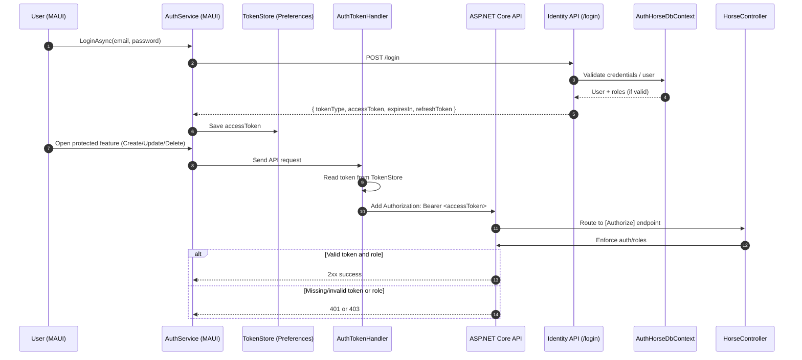

# Authentication and Authorization Guide

## Summary

This API supports two auth modes configured via `Auth:Enabled`.

- `Auth:Enabled = false` -> **Demo authentication mode**
- `Auth:Enabled = true` -> **ASP.NET Core Identity mode**

Authorization attributes on endpoints stay the same; authentication source changes by mode.

## Are JWTs Used In This Solution?

Yes, **JWT bearer tokens are used when `Auth:Enabled = true`**.

- API login endpoint: `POST /login` (mapped by `app.MapIdentityApi<IdentityUser>()`)
- Login response includes `tokenType`, `accessToken`, `expiresIn`, `refreshToken`
- MAUI stores `accessToken` in `TokenStore` (`Preferences`)
- `AuthTokenHandler` adds `Authorization: Bearer <accessToken>` to API requests
- `[Authorize]` and `[Authorize(Roles = "Admin")]` on controller actions enforce access

When `Auth:Enabled = false`, JWT is **not required**. The custom `DemoAuthenticationHandler` signs in a built-in demo principal for `[Authorize]` endpoints.

---

## Authentication Flow Diagram (Actual Implementation)

### Demo Mode Variant (`Auth:Enabled = false`)

- No `/login` token issuance is mapped.
- API auth scheme is `DemoAuth`.
- `DemoAuthenticationHandler` injects claims including role `Admin`.
- `[Authorize]` endpoints succeed without JWT for classroom/demo workflows.

---

## Mode 1: Auth Disabled (Demo Mode)

When auth is off, the app registers a custom demo authentication handler:

- `DemoAuthenticationHandler`

Purpose:

- Keep `[Authorize]` endpoints testable during no-auth labs.
- Avoid Identity complexity when students focus on repository/API fundamentals.

In this mode, Identity endpoints (`/register`, `/login`, `/refresh`) are **not** mapped.

---

## Mode 2: Auth Enabled (Identity Mode)

When auth is on:

- `AddIdentityApiEndpoints<IdentityUser>()`
- `AddRoles<IdentityRole>()`
- `AddEntityFrameworkStores<AuthHorseDbContext>()`
- `app.MapIdentityApi<IdentityUser>()`

This enables built-in Identity endpoints and role-aware authorization.

Common endpoints:

- `POST /register`
- `POST /login`
- `POST /refresh`

The app seeds admin role/user in development through `DbInitializer`.

---

## Authorization in Controllers

Controllers should use attributes such as:

- `[AllowAnonymous]` for public endpoints
- `[Authorize]` for authenticated access
- `[Authorize(Roles = "Admin")]` for role-restricted operations

These rules apply in both modes; only the identity source differs.

---

## Why Auth Mode Requires Separate Context/Database

Auth mode includes Identity schema.
No-auth mode excludes Identity schema.

To avoid EF migration/model mismatch, the app uses:

- `HorseDbContext` + `HorseNoAuthConnection`
- `AuthHorseDbContext` + `HorseAuthConnection`

This is intentionally more verbose (“bloated”) to keep mode switching reliable and teachable.

---

## Configuration Checklist

## No-auth mode

- `Auth:Enabled = false`
- `DataSources:SqlServer:Enabled = true` (if using SQL)
- `ConnectionStrings:HorseNoAuthConnection` valid

## Auth mode

- `Auth:Enabled = true`
- `DataSources:SqlServer:Enabled = true`
- `ConnectionStrings:HorseAuthConnection` valid
- Auth migrations applied for `AuthHorseDbContext`

---

## Security Notes for Students

- Use HTTPS in real deployments.
- Do not keep dev seed passwords in production.
- Demo mode is for classroom/dev convenience only.
- Role assignments determine access for restricted endpoints.
